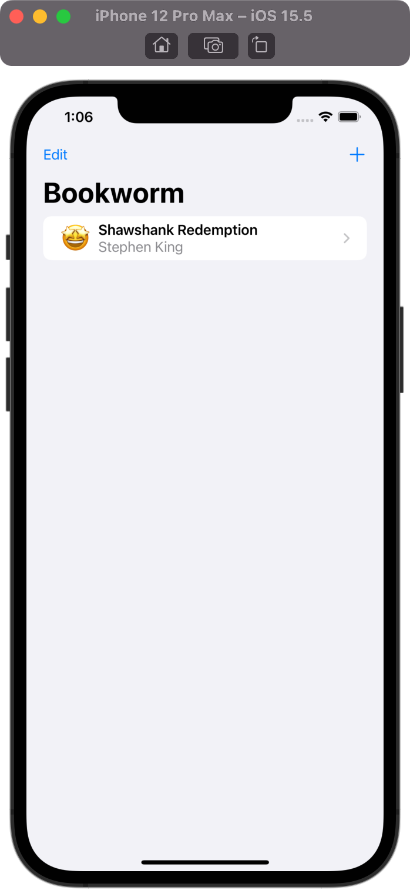
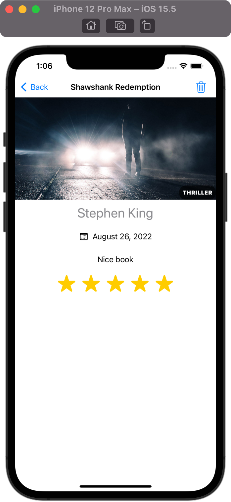
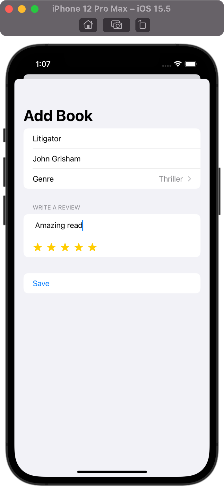

# Bookworm

## Project Description

The project is a part of 100 Days of SwiftUI curriculum by Paul Hudson [Hacking with swift](https://www.hackingwithswift.com/100/swiftui)

The app tracks which books you’ve read and what you thought of them.
The app utilizes Core Data and includes a star rating widget where the user can tap to leave a score for each book

## Project Screen

  

